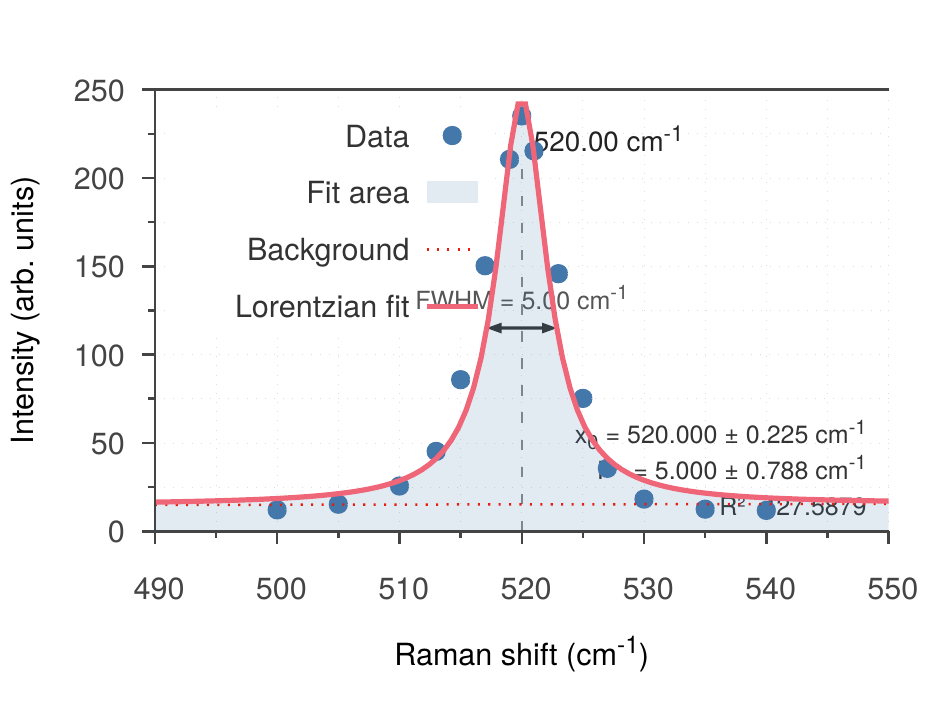
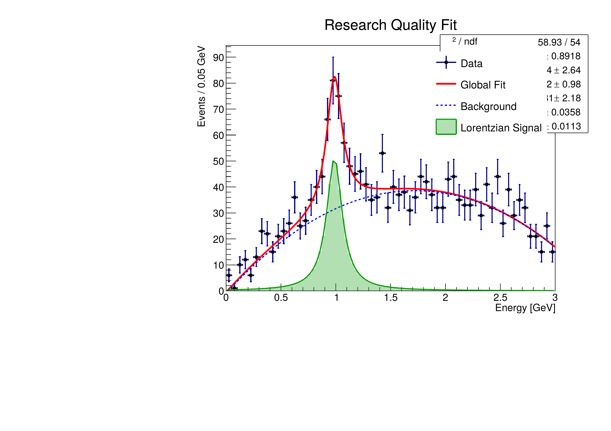
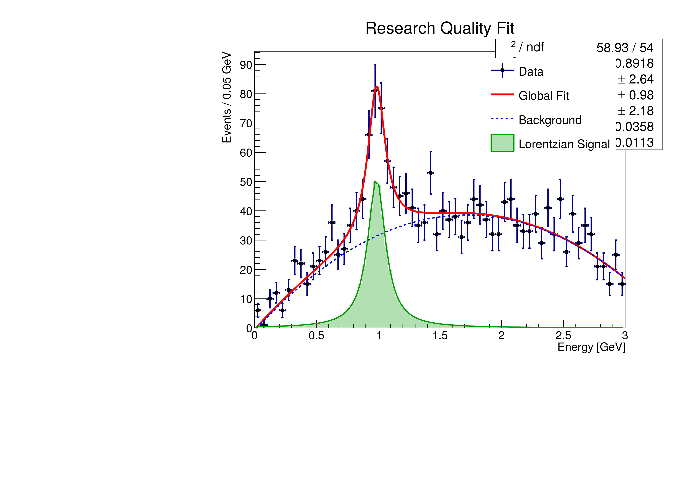
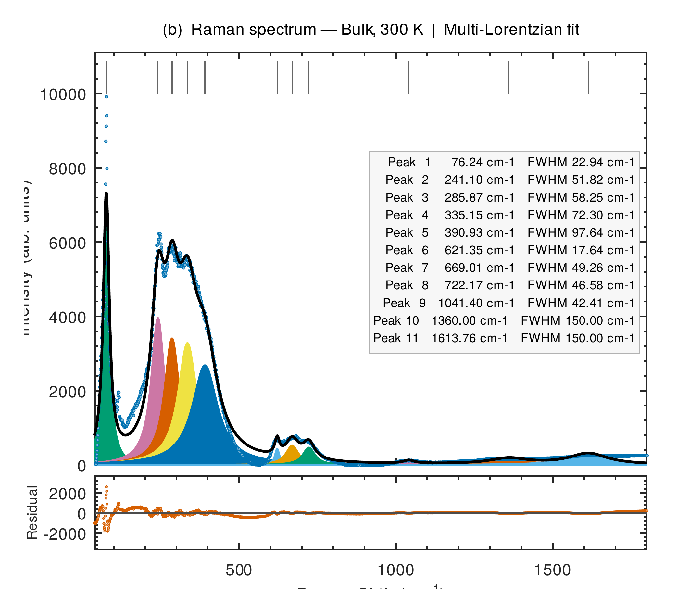

# Samsung Galaxy Tab S6 (SM-T860) — LineageOS + Ubuntu Chroot Guide

This repo documents everything needed to turn a stock Samsung Galaxy Tab S6 Wi-Fi (SM-T860) into a fully rooted Linux machine — running LineageOS 22.2 GSI with Magisk root, and a complete Ubuntu 24.04 LTS desktop environment via Termux chroot.

---

## Why Bother — Benefits vs Stock Android

The Tab S6 shipped on Android 12 and Samsung stopped OS updates. This setup gives it a second life with real benefits:

**OS and software**
- LineageOS 22.2 is based on Android 15/16 — three to four major versions ahead of what Samsung shipped
- Pure AOSP experience, no One UI coating, no Samsung or Google bloatware pre-installed
- Apps that Samsung marked as uninstallable are simply not there to begin with

**Privacy and security**
- [AdAway](https://adaway.org/) blocks ads at the hosts file level system-wide — every app, every browser, no exceptions
- On a non-rooted device you have to choose between AdAway (uses VPN slot) or ProtonVPN — you can't run both. With root you run AdAway at the system level and ProtonVPN simultaneously for tighter security
- No background telemetry from Samsung, Google Play Services is minimal or removable, no vendor analytics

**Ad-free apps**
- With root you can patch YouTube, Spotify, YouTube Music and similar apps to strip ads entirely — no subscription needed

**Battery and performance**
- No background processes from Samsung, no persistent Google services, no bloatware keeping the SoC awake
- Noticeably better idle battery life and thermal behaviour compared to stock
- Snapdragon 855 is still a capable chip — it was being wasted on a dead OS

**Linux on real hardware**
- The Ubuntu chroot runs directly on the ARM64 hardware via a chroot, not inside a VM or container
- Android and Ubuntu run in parallel on the same kernel — you switch between them without rebooting
- This is closer to a dual-OS setup than anything you can do on stock Android
- Full access to apt, Python, compilers, CLI tools, desktop apps via XFCE4 — a proper Linux environment on a tablet

**Tradeoffs**
- Bootloader unlock trips Knox — Samsung Pay and some banking apps will not work
- SafetyNet/Play Integrity requires extra Magisk modules (e.g. Shamiko) to pass — some apps detect root
- GSIs are not device-specific builds; minor quirks are possible (camera HAL, sensors)
- You own the update process — no OTA, manual flashing required for future LineageOS builds

---

## What This Covers

### Part 1 — [Flashing LineageOS & Rooting](./1.%20flashing-custom-rom.md)

Starting from stock Android, this guide walks through:

- Flashing the correct stock firmware via Odin as a clean base
- Unlocking the bootloader and installing TWRP recovery
- Flashing LineageOS 22.2 GSI (ARM64 A/B, with GApps)
- Rooting with Magisk v30.7 and installing BusyBox
- Fixing the speaker output (broken on most GSIs for this device)
- Updating Adreno GPU drivers via Magisk module
- Setting up essential apps: F-Droid, Termux, Termux-X11, file managers

### Part 2 — [Termux + Ubuntu 24.04 Chroot](./2.%20termux_ubuntu_chroot.md)

With the tablet rooted, this guide sets up a full Ubuntu desktop:

- Ubuntu 24.04 LTS ARM64 rootfs inside a chroot at `/data/local/chroot/ubuntu`
- XFCE4 desktop displayed via Termux-X11
- PulseAudio bridged over TCP for working audio
- Internal storage (`/sdcard`) and external SD card (`/sdcard_ext`) mounted inside the chroot
- Media packages: GStreamer, FFmpeg, VLC, MPV, yt-dlp, PipeWire
- Shell theming with Zsh, Oh My Zsh, Powerlevel10k, and fzf/zoxide/eza

---

### Part 3 — [Ubuntu Scientific Setup](./3.%20Ubuntu%20Scientific%20Setup.md)

With Ubuntu running inside the chroot, this section covers setting up a full scientific computing stack on ARM64:

- Miniforge + Mamba for conda package management
- SageMath and ROOT (CERN) installed via conda-forge
- VS Code (ARM64) with Jupyter kernel pointing to `sage-env`
- Remote display workflow: SSH from NixOS into Termux, render plots in XFCE4 on the tablet screen

---

## Scientific Plots — Running on the Tablet

All plots below were generated natively on the Tab S6 (Snapdragon 855, ARM64) inside the Ubuntu chroot — no x86 machine involved.

### Raman Spectroscopy — gnuplot

Raman spectrum of silicon processed and plotted using gnuplot (`raman_si.gp`) with raw data from `raman_data.dat`:

### Gaussian Peak Fitting — ROOT (C++)

Gaussian fit to spectral data using a ROOT macro (`FittingDemo.C`) running the CERN ROOT framework via conda-forge:

### Gaussian Peak Fitting — ROOT (Python)

Same fit reproduced via PyROOT (`FittingDemo.py`) confirming the Python interface works on ARM64:

---

### Raman Peak Fitting — Octave

Octave runs natively on ARM64 — no emulation needed. Complex Raman spectrum
fitted with 11 peaks, with background automatically evaluated and subtracted,
using `raman_fit.m`:

---

## Downloads Checklist

| # | File | Source |
|---|------|--------|
| 1 | `LineageOS-22.2-20260105-GAPPS-EXT4-GSI.7z` | [MisterZtr LineageOS GSI Releases](https://github.com/MisterZtr/LineageOS_gsi/releases) |
| 2 | Stock firmware for your region (e.g. `T860XXU5DXJ1` BTU/UK) | [samfw.com](https://samfw.com/firmware/SM-T860/BTU) |
| 3 | `twrp-3.7.0_9-0-gts6lwifi.img` + `.img.tar` | [dl.twrp.me/gts6lwifi](https://dl.twrp.me/gts6lwifi/) |
| 4 | Magisk APK v30.7 | [topjohnwu/Magisk releases](https://github.com/topjohnwu/Magisk/releases/tag/v30.7) |
| 5 | Odin3 v3.14.1 (patched) | [XDA thread](https://xdaforums.com/t/patched-odin-3-13-1.3762572/) |
| 6 | Android Platform Tools (Windows) | [developer.android.com](https://developer.android.com/tools/releases/platform-tools) |
| 7 | BuiltIn-BusyBox Magisk module | [Magisk-Modules-Alt-Repo](https://github.com/Magisk-Modules-Alt-Repo/BuiltIn-BusyBox/releases) |
| 8 | Speaker fix Magisk module | [XDA thread](https://xdaforums.com/t/gsi-4-speaker-fix-for-galaxy-tab-s6.4780990/) |
| 9 | Adreno driver Magisk module | [XDA thread](https://xdaforums.com/t/adreno-driver-update-magisk-module-for-tab-s6.4767424/) |
| 10 | Termux-X11 nightly APK | [github.com/termux/termux-x11](https://github.com/termux/termux-x11/releases) |

---

## Device

**Samsung Galaxy Tab S6 SM-T860** (Wi-Fi only)  
SoC: Snapdragon 855 · GPU: Adreno 640 · RAM: 6/8 GB · Android base: rooted LineageOS 22.2 GSI
